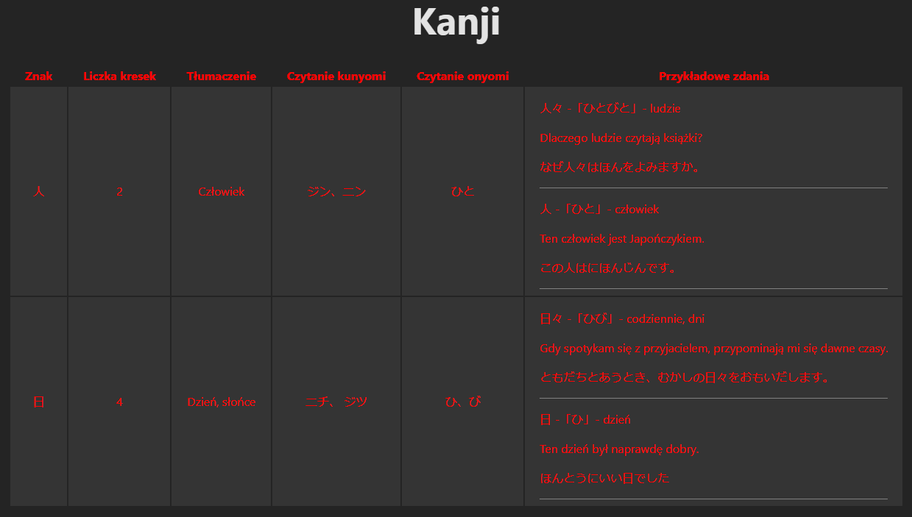

# Kanji Learn Web Page
Web page to learn Kanji.

## Table of contents
* [Technologies Used](#technologies-used)
* [Features](#features)
* [Screenshots](#screenshots)
* [Project Status](#project-status)
* [Setup](#setup)
* [Licene](#licence)

## Technologies Used
- .NET 8
- Entity Framework 8
- Vite 4
- React 18
- Visual Studio 2022
- PostgreSQL 16

## Features
- Each Kanji has a kun'yomi and on'yomi reading.
- Each Kanji also has expamlpe senteces with the particular Kanji.
- N5 Kanji list.

## Screenshots

## Project Status
The project is in progress.

## Setup
_In progress_

## Licence
> [Full content of the licence](LICENSE).

MIT